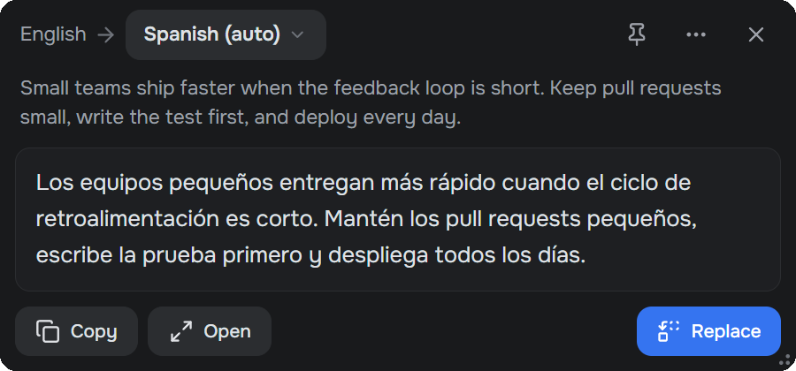
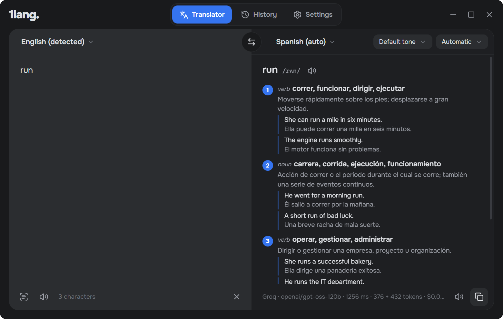
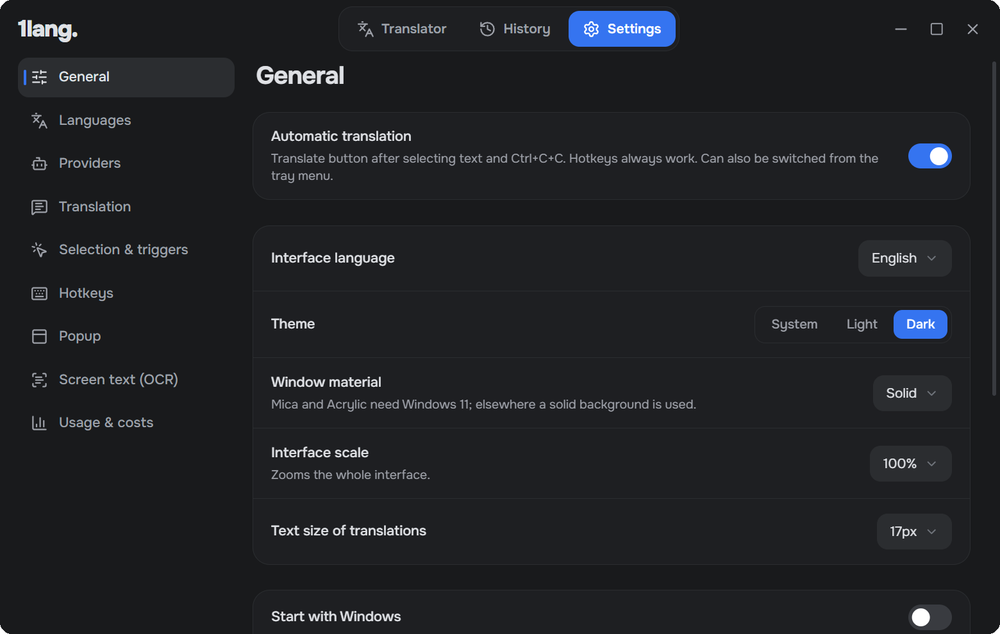

# 1lang

**Translate anything on your screen without leaving the app you're in.**

A small, fast translator for Windows that works like the DeepL desktop app, but is open source and runs on the AI model or translation service you pick.

[Download for Windows](https://github.com/q-sn/1lang/releases/latest) · [Features](#features) · [FAQ](#faq)

## Why 1lang

DeepL's desktop app made quick translation feel effortless, but it's closed, the free plan is limited, and you can't choose what does the translating. 1lang keeps the same workflow and leaves that choice to you: a fast LLM on Groq for everyday text, DeepL or Google when you prefer them, or a local model when the text shouldn't leave your computer.

## Features

**Translate selected text in any app.** Select text with the mouse and click the small button that appears next to it, press `Ctrl+Alt+T`, or press `Ctrl+C` twice. The translation shows up in a compact popup and streams in as it's generated.

**Replace text in place.** Write a message in your language, select it and press `Ctrl+Alt+R`. 1lang swaps it for the translation right in Slack, Telegram, the browser or wherever you're typing.

**Translate text from the screen.** Press `Ctrl+Alt+O` and drag over any part of the screen: an image, a video, a game, a scanned PDF. Text recognition uses the OCR built into Windows, so nothing extra to install.

**A dictionary for single words.** Look up one word and you get its meanings, transcription and example sentences instead of a single bare translation.

**A full translator window.** Type or paste text, translate as you type, pick the tone, swap languages, and go back to anything in your history.

**Choose your engine.**
- AI models: Groq, OpenAI, Google Gemini, Anthropic, OpenRouter, or local models through Ollama and LM Studio
- Translation services: DeepL, Google Cloud Translation, Microsoft Translator
- Google Translate works without any key, so 1lang is usable right after installing

You can enable several at once. If one fails or hits a limit, the next one takes over.

**Translations that understand context.** When you translate a selection, the AI can see the surrounding paragraph, which helps with ambiguous words, gender and terminology. You can turn this off.

**It knows which way to translate.** Set your language and a second one (for example Russian and English). Text in your language is translated into the second, everything else into yours. No switching back and forth.

**Private by default.** No account, no telemetry, no servers of our own. Text goes only to the provider you choose, and API keys are stored in Windows Credential Manager.

## Getting started

1. [Download the installer](https://github.com/q-sn/1lang/releases/latest) and run it. Windows may show a SmartScreen warning because the app isn't code-signed yet: click **More info → Run anyway**.
2. Optional, but recommended: get a free API key at [console.groq.com/keys](https://console.groq.com/keys) and paste it in **Settings → Providers → Groq**. Without a key 1lang uses Google Translate.
3. Select some text anywhere and press `Ctrl+Alt+T`.

1lang lives in the system tray and updates itself in the background.

| Shortcut | Action |
| --- | --- |
| `Ctrl+Alt+T` | Translate selected text |
| `Ctrl+C` `C` | Translate what you just copied |
| `Ctrl+Alt+R` | Replace selected text with its translation |
| `Ctrl+Alt+O` | Translate an area of the screen |
| `Ctrl+Alt+L` | Open the translator window |

All shortcuts can be changed in the settings.

## FAQ

**Is 1lang free?**
Yes. The app is free and open source under the MIT license. Translation itself is free with Google Translate or Groq's free tier. With paid providers you pay them directly at their normal rates, and 1lang shows how much each translation cost.

**How is it different from DeepL?**
It works the same way (select text, get a translation in a popup, Ctrl+C+C), but you choose the engine, it's open source, it has OCR for text on the screen, a dictionary for single words, and it can replace the text you selected with the translation.

**Which languages are supported?**
37 languages, including English, Spanish, Russian, German, French, Portuguese, Italian, Ukrainian, Polish, Turkish, Chinese, Japanese and Korean. The interface is available in English, Russian and Spanish.

**Does it work offline?**
With a local model in Ollama or LM Studio, yes. Text recognition from the screen always works offline.

**Is my text sent anywhere?**
Only to the translation provider you selected. 1lang has no backend and collects nothing. Repeated translations are cached on your computer.

**What about macOS and Linux?**
Windows comes first. The translation engine is cross-platform, so other systems are possible later.

## Contributing

Bug reports and ideas are welcome in [Issues](https://github.com/q-sn/1lang/issues). To build the app yourself, see [DEVELOPMENT.md](DEVELOPMENT.md).

## License

[MIT](LICENSE)
